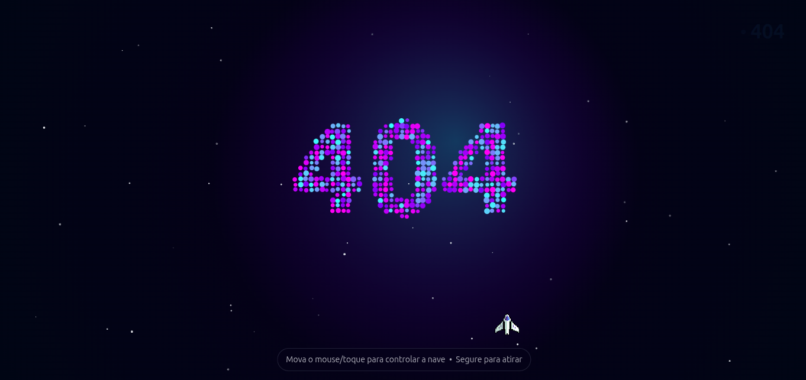
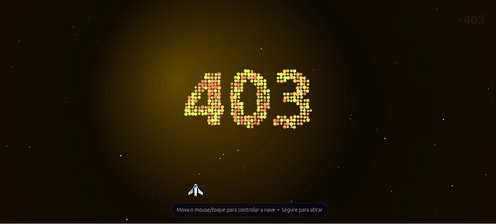
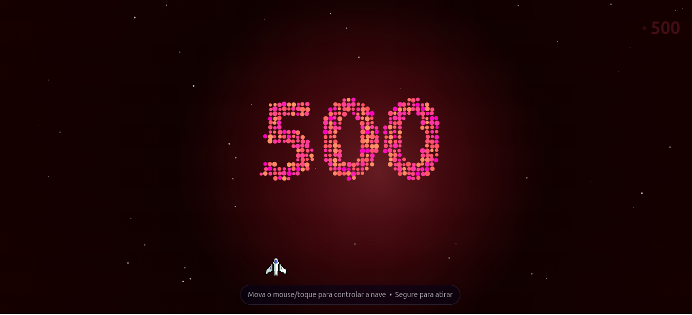

<div align="center">
  
</div>

## Sobre o Projeto

Sempre achei legal o sistema do Google Chrome quando cai a internet e você pode jogar aquele jogo do dinossauro. Então pensei: por que não fazer algo parecido para erros no nosso sistema?

Quando acontecer algum erro (404, 403, 500...), ao invés do cliente ficar parado olhando para uma tela de erro sem graça, ele pode **jogar um mini game** enquanto os devs tentam localizar e corrigir o problema!

## Como Funciona

Esta é uma página de erro interativa onde o usuário controla uma nave espacial e precisa destruir o código do erro atirando nele. É uma forma divertida de transformar uma experiência frustrante (encontrar um erro) em algo divertido e memorável.

Cada tipo de erro tem seu próprio tema visual:
- **404 (Not Found)** - Tema azul/roxo 🔵 com círculos flutuantes
- **403 (Forbidden)** - Tema laranja/amarelo 🟡 com grade quebrada
- **500 (Internal Server Error)** - Tema vermelho 🔴 com linhas cruzadas

**Cada erro possui elementos visuais únicos:**
- 🎨 Background com gradientes exclusivos
- ✨ Nebulosa com cores personalizadas
- 🔢 Código do erro em diferentes cores
- 📐 Padrões de fundo animados únicos
- 💥 Partículas e explosões temáticas

### Funcionalidades

- 🚀 Controle uma nave espacial com o mouse ou toque
- 💥 Atire para destruir o código do erro
- 🎵 Efeitos sonoros interativos
- 📱 Totalmente responsivo e acessível
- ♿ Suporte completo a ARIA para acessibilidade
- 🎨 Temas diferenciados por tipo de erro
- ♻️ Código reutilizável - mesma base para todos os erros

## Preview

| Erro 404 | Erro 403 | Erro 500 |
|----------|----------|----------|
|  |  |  |

## Tecnologias Utilizadas

- HTML5 Canvas
- CSS3
- JavaScript Vanilla
- Web Audio API

## Como Usar

1. Abra qualquer arquivo HTML no navegador (`404.html`, `403.html` ou `500.html`)
2. Mova o mouse (ou toque na tela em dispositivos móveis) para controlar a nave
3. Segure o botão do mouse (ou toque) para atirar
4. Destrua o código do erro e escolha entre jogar novamente ou voltar para a home

## Estrutura do Projeto

```
error404/
laranja)
├── 403.html           # Página de erro 403 (
azul/roxo)
├── 404.html           # Página de erro 404 (tema azul)
vermelho)
├── 500.html           # Página de erro 500 (tema
├── README.md          # Documentação do projeto
├── doc/               # Screenshots e documentação
│   ├── 403.png        # Screenshot do erro 403
│   ├── 404.png        # Screenshot do erro 404
│   └── 500.png        # Screenshot do erro 500
└── static/            # Recursos estáticos
    ├── css/
    │   └── game.css   # Estilos compartilhados com temas customizáveis
    ├── img/
    │   └── nave.png   # Sprite da nave espacial
    ├── js/
    │   └── game.js    # Lógica do jogo reutilizável
    └── sound/
        └── bubble.mp3 # Efeito sonoro de acerto
```

## Arquitetura

O projeto foi desenvolvido para **máxima reutilização de código**:

- **game.css** - Usa variáveis CSS customizáveis via `data-error` attribute no body
- **game.js** - Lê configurações dinâmicas de `data-error` e `data-error-text`
- Cada página HTML define apenas seu tema e texto específico
- Zero duplicação de lógica entre diferentes erros

### Adicionando Novos Erros

Para criar uma nova página de erro (ex: 502):

1. Copie qualquer arquivo HTML existente
2. Atualize o atributo `data-error="502"` no `<body>`
3. Adicione as cores do tema no `game.css` em `:root`
4. Personalize título e textos

Não é necessário duplicar JavaScript ou CSS!

## Objetivo

Transformar erros em momentos de diversão e engajamento, mantendo o usuário entretido enquanto aguarda a resolução do problema. Afinal, se vamos ter erros, que sejam erros divertidos! 😄

---

**Divirta-se jogando e sinta-se à vontade para contribuir com melhorias!** 🚀
